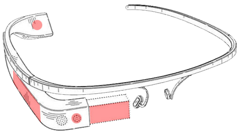

# Bem vindo ao Projeto Glass!
Eu desenvolvi um site completo utilizando as principais funções de HTML5/CSS3 e algumas funções de JavaScript também, aonde o usuário pode conferir tudo sobre o Project Glass, que foi o tema abordado para desenvolvermos o site durante o curso.

Principais recursos trabalhados:
* Interface totalmente estilizada em CSS3
* Mapeamento de imagens e detalhes técnicos
* Imagens com efeitos
* Compartilhamento de vídeo e áudio
* Funções JavaScript
* Criação de formulário completo para cadastro do usuário e compra

---

__Você pode acessar a página do meu projeto__ 
<a href="https://georgeenriquebravo.github.io/Projeto-Glass/" target="_blank">
    clicando aqui
</a>
.

---
##  &ensp; Project Glass &ensp; 

O __*Google Glass*__ é um dispositivo semelhante a um par de óculos, que fixados em um dos olhos, disponibiliza uma pequena tela acima do campo de visão. A pequena tela apresenta ao seu utilizador mapas, opções de música, previsão do tempo e rotas de mapas; e além disso, também é possível efetuar chamadas de vídeo ou tirar fotos de algo que se esteja a ver; e compartilhar imediatamente através da internet.

---

# Tecnologias Utilizadas
Nesse projeto foram utilizadas as seguintes tecnologias:

    
    
    
    

